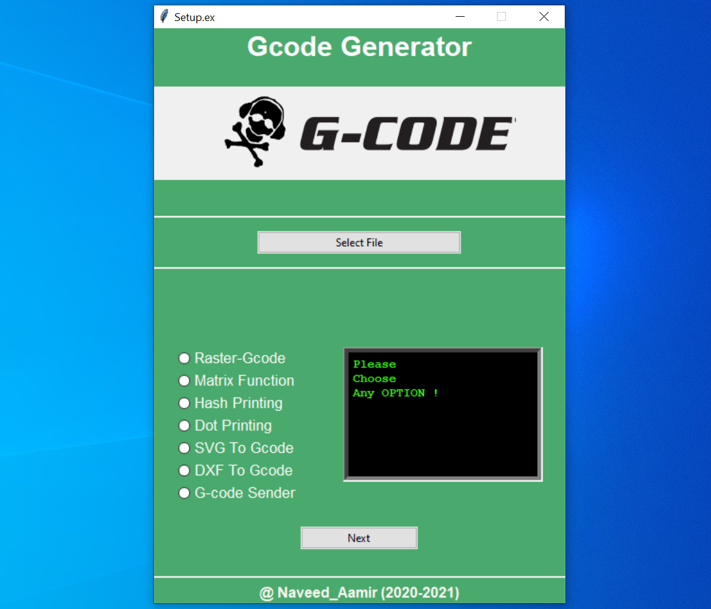
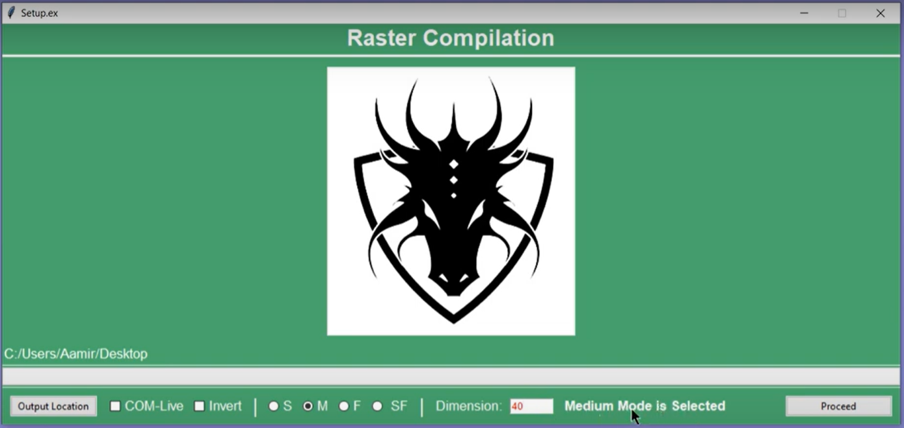
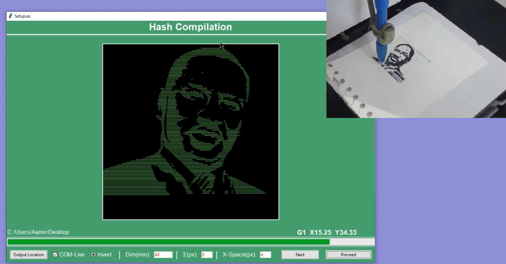
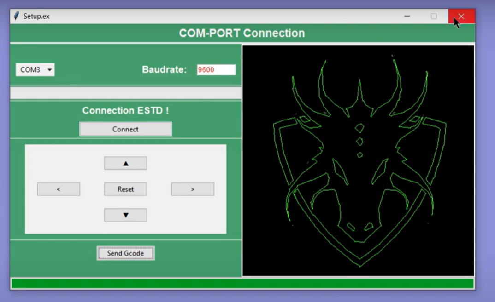

# Gcode Generator Software (Version 1.0)

I Fabricated a CNC machine as my final year project. Software part was so hectic, as 
I had to convert image into G-code file using INKSCAPE software and then I used to select 
the generated G-code file to visualise it with another software and List goes on. That's why overall proceess was so painfull, 
so being a developer I came up with this idea, why not to create a software which has all these functionalities into one.

It is very difficult to find a software which can convert any type 
of image file into G-code and send it to the CNC machine parallelly at a same time after
maintianig the COM Connection with Micro-controller and could see working progress visually. So finally here it is ! This software is 
writting in python3 and Tkinter library is used to make User interface.

<h4>Link for Youtube Video: https://youtu.be/CsNLeWpOZ_k </h4>
<h4>Link for .exe (setup): https://drive.google.com/drive/folders/1q6yQTF9iraXVfrgFC2kPzPZUfiSWEtS-?usp=sharing</h4>

  

  

  

  

# Contents

* Features
* Technology Used
* Note for contributors
* Feedback
* Developer

# Features

* User can adjust Contrast and Brightness and convert into greyScale before processing. It helps the algorithm to read the boundaries more easily.
* Different Speed modes are availble such as Slow, Fast, Super-fast in Raster-Gcode, consequently compromise with the quality.
* Automatically convert reactangular image file into square internally during processing, to adjust CNC machine configuration.
* COM port connectivity is available in only first four mode. With the help of this function, User don't have to wait for G-code file to be generated, instead maintain the     COM connection with Micro-Controller first and visualize the working progress live.
* User can send G-code file separately to CNC machine using "G-code Sender". This is useful for those modes which don't have COM port connectivity.
* This software basically has 7 modes to process differnt types of image and with differnt methods. Available Modes are :

<b>1. Raster-Gcode:</b> 
Take raster images (*.jpg ,*.png) as input and generate G-code file as Output along with live visualisation.There are options like slow, fast and super-fast but consequently quality of g-code file is compromised .

<b>2. Matrix Function:</b> It divides the image into multiple rows and cols using split and append the G-code of each gridImage( i x j ) successively to final output. I made this option for personal use.  

<b>3. Hash Printing:</b> Take raster images (*.jpg ,*.png) as input and divide the image into multiple horizontal lines stacked on top of each other and then produce Gcode of the same. This mode is kind of similar to laser technique.

<b>4. Dot Printing:</b> Take raster images (*.jpg ,*.png) as input and convert to Dotted image and then produce Gcode of the same.

<b>5. SVG To Gcode:</b>Takes *.svg image formate as input and Generate the Gcode file. COM port connectivity and live visualisation is not available in this mode, User has to generate the g-code file first and then use G-code Sender mode to access COM port saparately.

<b>6. DXF To Gcode:</b>Takes *.dxf file formate as input and Generate the Gcode file. COM port connectivity and live visualisation is not available in this mode, User has to generate the g-code file first and then use G-code Sender mode to access COM port saparately. 

<b>7. G-code Sender:</b> G-code Sender to send the G-code file separately using COM-PORT along with live Visualisation.

# Technology Used

* Python3, OpenCV2 
* numpy, Pillow  
* Image Processing concepts are used
* tkinter is used for User Interface.
* Serial library is used to Maintain COM port Connection.

# Note for contributors

* All Suggestions are Accepted and Wellcome.
* Fork repository and Contribute.
* Contact naveedamir484@gmail.com for any query.
* Extrace zip file or Clone this repository.
* Open this Project in Visual Studio.
* Open setup.py file and Run it ....Ready to go.

# Feedback
Feel free to report issues and bugs. It will be helpful for further upgradation of this website.

# Developer
<li>This software is open source and free to use for everyone.</li>
<li>Developed By: Naveed Aamir (MNNIT Allahabad)</li>
<li>Email: naveedamir484@gmail.com </li>
<li>Date: July 2021</li>
<li>Language: Python3</li>

